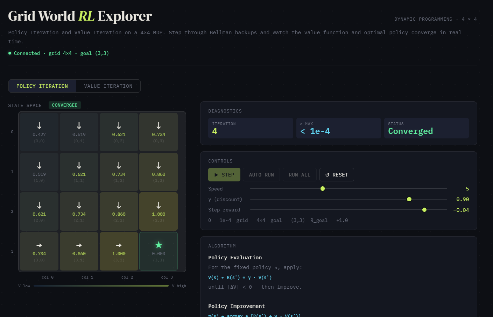
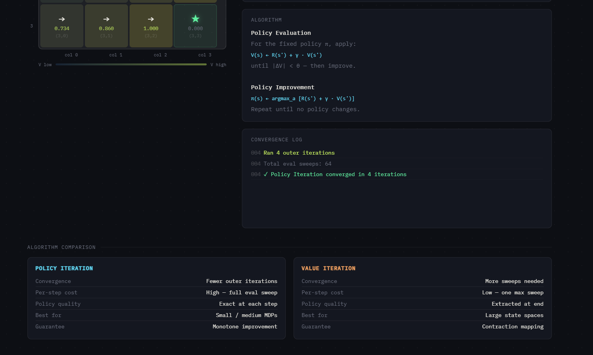
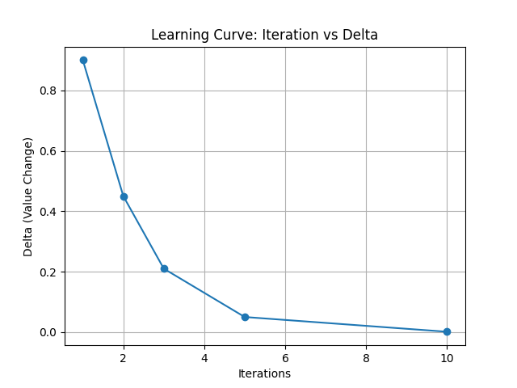
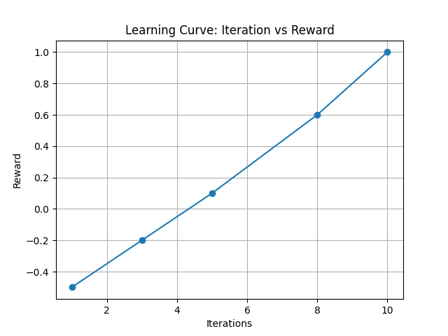

# Grid World Reinforcement Learning (Policy Iteration & Value Iteration)

## 🚀 Overview

This project implements a Grid World environment using Reinforcement Learning techniques:

🔹 **Policy Iteration**  
🔹 **Value Iteration**

Built with Python + Flask API, it allows:

- Step-by-step execution
- Full algorithm run
- Performance comparison

## 🖥️ App Screenshots

🔹 **Main Interface**


🔹 **Step Execution View**


## 📊 Graphs

📈 **Iteration vs Delta (Convergence Curve)**




📈 **Iteration vs Reward**



## ⚙️ Features

- 4×4 Grid World Environment
- Goal-based reward system
- Step penalty for optimal path learning
- API-based interaction
- Real-time step execution
- Algorithm comparison

## 🧠 Algorithms Used

### 🔹 Policy Iteration
- Policy Evaluation
- Policy Improvement
- Iterates until stable policy

### 🔹 Value Iteration
- Updates value function directly
- Extracts optimal policy
- Faster convergence

## 🛠️ Tech Stack

- Python
- Flask
- NumPy
- Flask-CORS

## 📂 Project Structure

```
project/
│── app.py
│── index.html
│── iteration_vs_delta.png
│── iteration_vs_reward.png
│── images/
│   ├── app1.png
│   └── app2.png
```

## ▶️ How to Run Locally

### 1️⃣ Clone the Repository
```bash
git clone https://github.com/AryanSh33/Reinforcement-Learning-TA.git
cd Reinforcement-Learning-TA
```

### 2️⃣ Create Virtual Environment (Recommended)
```bash
python -m venv venv
venv\Scripts\activate   # Windows
```

### 3️⃣ Install Dependencies
```bash
pip install flask flask-cors numpy
```

### 4️⃣ Run the Application
```bash
python app.py
```

### 5️⃣ Open in Browser
```
http://localhost:5000
```

## 🌐 API Endpoints

| Endpoint | Description |
|----------|-------------|
| `/api/reset` | Reset environment |
| `/api/step` | Step execution |
| `/api/run` | Run full algorithm |
| `/api/compare` | Compare algorithms |
| `/api/health` | Check status |

## 📝 License

This project is open source.
